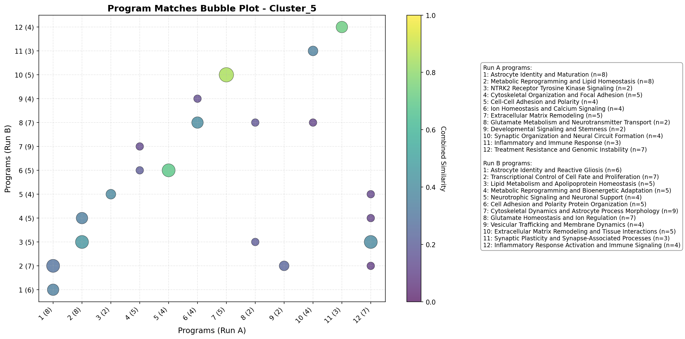
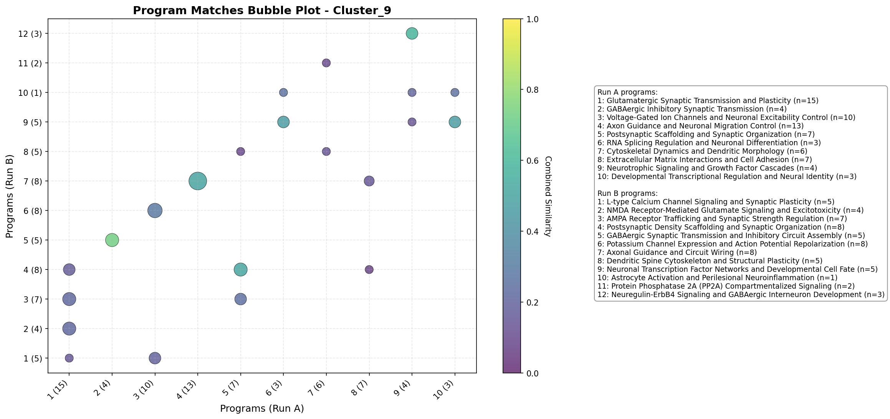

# Validation Report: Astrocytoma_cnmf_archive_runs

Master validation report comparing all DeepSearch runs across queries.

## Summary

- **Total Matches**: 43
- **Queries**: 8

- **Average Gene Jaccard**: 0.496
- **Average Name Similarity**: 0.356
- **Average Combined Similarity**: 0.454

## Per-Query Analysis

### Query: Cluster_0

**Matches**: 2

#### Comparison Table

| Run A | Run B | Program A | Program B | Gene Jaccard | Name Sim | Combined |
|-------|-------|-----------|-----------|--------------|----------|----------|
| 20251216_203354 | 20251216_214706 | Cytoskeletal Dynamics and Cell Migration | Cytoskeletal Dynamics and Process Motility | 0.429 | 0.429 | 0.429 |
| 20251216_203354 | 20251216_214706 | Lipid Metabolism and Membrane Composition Regulation | Lipid Metabolism and Apolipoprotein-E Signaling | 0.500 | 0.375 | 0.462 |

#### Bubble Plot

#### Individual Run Reports

- [20251216_203354](../Cluster_0/20251216_203354/deepsearch_container.md)
- [20251216_214706](../Cluster_0/20251216_214706/deepsearch_container.md)

### Query: Cluster_1

**Matches**: 3

#### Comparison Table

| Run A | Run B | Program A | Program B | Gene Jaccard | Name Sim | Combined |
|-------|-------|-----------|-----------|--------------|----------|----------|
| 20251216_203928 | 20251216_215242 | Extracellular Matrix Remodeling and Microenvironment Sculpting | Extracellular Matrix Remodeling and Integrin-Mediated Signaling | 0.263 | 0.500 | 0.334 |
| 20251216_203928 | 20251216_215242 | Transcriptional Control of Inflammatory and Stress Responses | AP-1 Transcription Factor-Driven Stress Response | 0.500 | 0.091 | 0.377 |
| 20251216_203928 | 20251216_215242 | Cell Adhesion, Migration, and Extracellular Matrix Interactions | Extracellular Matrix Remodeling and Integrin-Mediated Signaling | 0.471 | 0.300 | 0.419 |

#### Bubble Plot

#### Individual Run Reports

- [20251216_203928](../Cluster_1/20251216_203928/deepsearch_container.md)
- [20251216_215242](../Cluster_1/20251216_215242/deepsearch_container.md)

### Query: Cluster_2

**Matches**: 5

#### Comparison Table

| Run A | Run B | Program A | Program B | Gene Jaccard | Name Sim | Combined |
|-------|-------|-----------|-----------|--------------|----------|----------|
| 20251216_204435 | 20251216_215657 | Synaptic Adhesion and Neuronal Contact | Synaptic Adhesion and Connectivity | 0.357 | 0.500 | 0.400 |
| 20251216_204435 | 20251216_215657 | Growth Factor Receptor Signaling | Growth Factor Receptor Signaling | 0.286 | 1.000 | 0.500 |
| 20251216_204435 | 20251216_215657 | Glutamatergic Synaptic Transmission | Glutamate and GABA Neurotransmission | 0.667 | 0.000 | 0.467 |
| 20251216_204435 | 20251216_215657 | Extracellular Matrix Remodeling and Proteolysis | Tumor Microenvironment Remodeling and Immunomodulation | 0.353 | 0.250 | 0.322 |
| 20251216_204435 | 20251216_215657 | Calcium Signaling and Metabolic Coupling | Astrocyte-Specific Metabolic Support | 0.375 | 0.143 | 0.305 |

#### Bubble Plot

#### Individual Run Reports

- [20251216_204435](../Cluster_2/20251216_204435/deepsearch_container.md)
- [20251216_215657](../Cluster_2/20251216_215657/deepsearch_container.md)

### Query: Cluster_3

**Matches**: 4

#### Comparison Table

| Run A | Run B | Program A | Program B | Gene Jaccard | Name Sim | Combined |
|-------|-------|-----------|-----------|--------------|----------|----------|
| 20251216_204928 | 20251216_220144 | Cell Adhesion Plasticity | Cell Adhesion and Junction Organization | 0.333 | 0.333 | 0.333 |
| 20251216_204928 | 20251216_220144 | Cytoskeletal Reorganization and Enhanced Motility | Cytoskeletal Remodeling and Cell Migration | 0.538 | 0.250 | 0.452 |
| 20251216_204928 | 20251216_220144 | Extracellular Matrix Remodeling | Extracellular Matrix Remodeling and Invasion | 0.364 | 0.600 | 0.435 |
| 20251216_204928 | 20251216_220144 | Transcriptional Reprogramming | Transcriptional Regulation and Developmental Progenitor State | 0.375 | 0.143 | 0.305 |

#### Bubble Plot

#### Individual Run Reports

- [20251216_204928](../Cluster_3/20251216_204928/deepsearch_container.md)
- [20251216_220144](../Cluster_3/20251216_220144/deepsearch_container.md)

### Query: Cluster_5

**Matches**: 10

#### Comparison Table

| Run A | Run B | Program A | Program B | Gene Jaccard | Name Sim | Combined |
|-------|-------|-----------|-----------|--------------|----------|----------|
| 20251216_210008 | 20251216_221233 | Astrocyte Identity and Maturation | Astrocyte Identity and Reactive Gliosis | 0.273 | 0.500 | 0.341 |
| 20251216_210008 | 20251216_221233 | Metabolic Reprogramming and Lipid Homeostasis | Lipid Metabolism and Apolipoprotein Homeostasis | 0.444 | 0.429 | 0.440 |
| 20251216_210008 | 20251216_221233 | Metabolic Reprogramming and Lipid Homeostasis | Metabolic Reprogramming and Bioenergetic Adaptation | 0.300 | 0.429 | 0.339 |
| 20251216_210008 | 20251216_221233 | NTRK2 Receptor Tyrosine Kinase Signaling | Neurotrophic Signaling and Neuronal Support | 0.500 | 0.111 | 0.383 |
| 20251216_210008 | 20251216_221233 | Cell-Cell Adhesion and Polarity | Cell Adhesion and Polarity Protein Organization | 0.800 | 0.429 | 0.689 |
| 20251216_210008 | 20251216_221233 | Ion Homeostasis and Calcium Signaling | Glutamate Homeostasis and Ion Regulation | 0.375 | 0.429 | 0.391 |
| 20251216_210008 | 20251216_221233 | Extracellular Matrix Remodeling | Extracellular Matrix Remodeling and Tissue Interactions | 1.000 | 0.500 | 0.850 |
| 20251216_210008 | 20251216_221233 | Synaptic Organization and Neural Circuit Formation | Synaptic Plasticity and Synapse-Associated Processes | 0.400 | 0.222 | 0.347 |
| 20251216_210008 | 20251216_221233 | Inflammatory and Immune Response | Inflammatory Response Activation and Immune Signaling | 0.750 | 0.667 | 0.725 |
| 20251216_210008 | 20251216_221233 | Treatment Resistance and Genomic Instability | Lipid Metabolism and Apolipoprotein Homeostasis | 0.500 | 0.111 | 0.383 |

#### Bubble Plot

#### Individual Run Reports

- [20251216_210008](../Cluster_5/20251216_210008/deepsearch_container.md)
- [20251216_221233](../Cluster_5/20251216_221233/deepsearch_container.md)

### Query: Cluster_6

**Matches**: 7

#### Comparison Table

| Run A | Run B | Program A | Program B | Gene Jaccard | Name Sim | Combined |
|-------|-------|-----------|-----------|--------------|----------|----------|
| 20251216_210505 | 20251216_221758 | Synaptic Adhesion and Plasticity | Cell Adhesion and Recognition Molecules | 0.533 | 0.286 | 0.459 |
| 20251216_210505 | 20251216_221758 | Voltage-Gated Ion Channels and Intrinsic Excitability | Voltage-Gated Ion Channels and Neuronal Excitability | 0.800 | 0.714 | 0.774 |
| 20251216_210505 | 20251216_221758 | Oligodendrocyte Lineage Development and Myelination | Glial Lineage Specification and Maintenance | 0.500 | 0.250 | 0.425 |
| 20251216_210505 | 20251216_221758 | Fibroblast Growth Factor and Morphogenic Signaling | Growth Factor Receptor Signaling and Oncogenic Proliferation | 0.286 | 0.444 | 0.333 |
| 20251216_210505 | 20251216_221758 | Growth Factor Receptors and Receptor Tyrosine Kinase Signaling | Growth Factor Receptor Signaling and Oncogenic Proliferation | 0.429 | 0.500 | 0.450 |
| 20251216_210505 | 20251216_221758 | Extracellular Matrix Organization and Developmental Signaling | Extracellular Matrix Remodeling and Collagen Organization | 0.333 | 0.500 | 0.383 |
| 20251216_210505 | 20251216_221758 | RNA-Binding Protein-Mediated Post-transcriptional Control | RNA-Binding Proteins and Post-Transcriptional Gene Regulation | 0.500 | 0.250 | 0.425 |

#### Bubble Plot

#### Individual Run Reports

- [20251216_210505](../Cluster_6/20251216_210505/deepsearch_container.md)
- [20251216_221758](../Cluster_6/20251216_221758/deepsearch_container.md)

### Query: Cluster_8

**Matches**: 6

#### Comparison Table

| Run A | Run B | Program A | Program B | Gene Jaccard | Name Sim | Combined |
|-------|-------|-----------|-----------|--------------|----------|----------|
| 20251216_211633 | 20251216_222831 | Oligodendroglial Transcriptional Specification | Oligodendrocyte Specification and Lineage Identity | 0.500 | 0.143 | 0.393 |
| 20251216_211633 | 20251216_222831 | Oligodendroglial Transcriptional Specification | Transcriptional Regulation of Glial Identity and Chromatin Organization | 0.500 | 0.100 | 0.380 |
| 20251216_211633 | 20251216_222831 | Myelin Structural Proteins and Compaction | Myelin Protein Synthesis and Maintenance | 0.562 | 0.250 | 0.469 |
| 20251216_211633 | 20251216_222831 | Myelin Lipid Biosynthesis and Homeostasis | Lipid Metabolism and Myelin Lipid Biogenesis | 0.800 | 0.429 | 0.689 |
| 20251216_211633 | 20251216_222831 | Cell-Cell Adhesion and Neuronal-Glial Communication | Central Nervous System Cell Adhesion and Barrier Formation | 0.364 | 0.182 | 0.309 |
| 20251216_211633 | 20251216_222831 | Potassium Channel Regulation and Osmotic Homeostasis | Ion Homeostasis and Electrolyte Regulation | 0.333 | 0.375 | 0.346 |

#### Bubble Plot

#### Individual Run Reports

- [20251216_211633](../Cluster_8/20251216_211633/deepsearch_container.md)
- [20251216_222831](../Cluster_8/20251216_222831/deepsearch_container.md)

### Query: Cluster_9

**Matches**: 6

#### Comparison Table

| Run A | Run B | Program A | Program B | Gene Jaccard | Name Sim | Combined |
|-------|-------|-----------|-----------|--------------|----------|----------|
| 20251216_212120 | 20251216_223257 | GABAergic Inhibitory Synaptic Transmission | GABAergic Synaptic Transmission and Inhibitory Circuit Assembly | 0.800 | 0.571 | 0.731 |
| 20251216_212120 | 20251216_223257 | Axon Guidance and Neuronal Migration Control | Axonal Guidance and Circuit Wiring | 0.615 | 0.222 | 0.497 |
| 20251216_212120 | 20251216_223257 | Postsynaptic Scaffolding and Synaptic Organization | Postsynaptic Density Scaffolding and Synaptic Organization | 0.364 | 0.833 | 0.505 |
| 20251216_212120 | 20251216_223257 | RNA Splicing Regulation and Neuronal Differentiation | Neuronal Transcription Factor Networks and Developmental Cell Fate | 0.600 | 0.167 | 0.470 |
| 20251216_212120 | 20251216_223257 | Neurotrophic Signaling and Growth Factor Cascades | Neuregulin-ErbB4 Signaling and GABAergic Interneuron Development | 0.750 | 0.200 | 0.585 |
| 20251216_212120 | 20251216_223257 | Developmental Transcriptional Regulation and Neural Identity | Neuronal Transcription Factor Networks and Developmental Cell Fate | 0.600 | 0.167 | 0.470 |

#### Bubble Plot

#### Individual Run Reports

- [20251216_212120](../Cluster_9/20251216_212120/deepsearch_container.md)
- [20251216_223257](../Cluster_9/20251216_223257/deepsearch_container.md)
