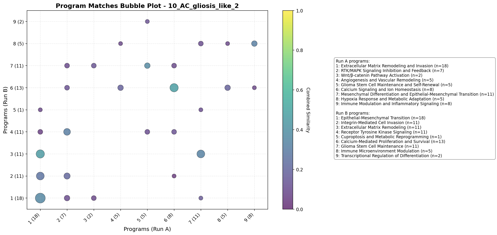
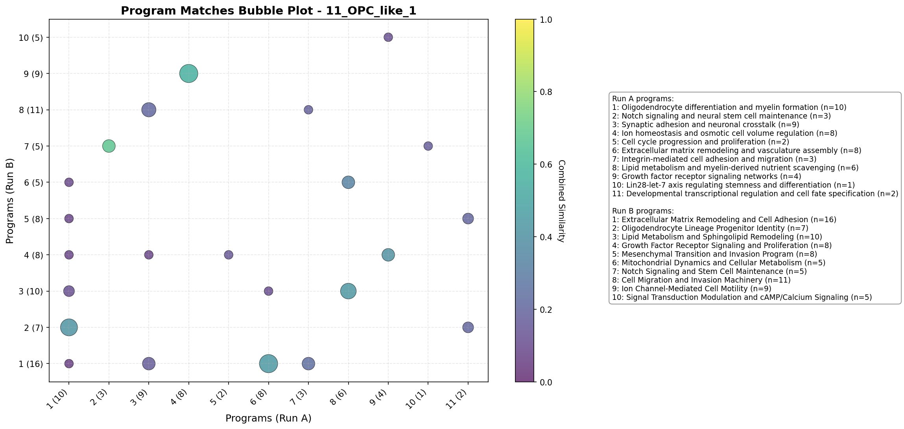
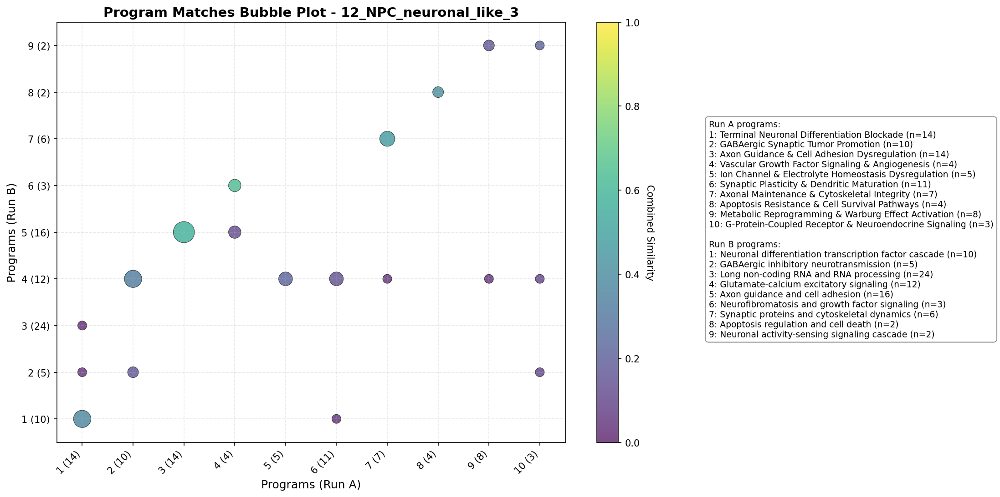
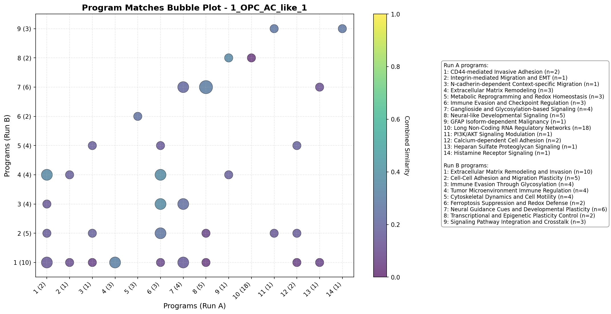
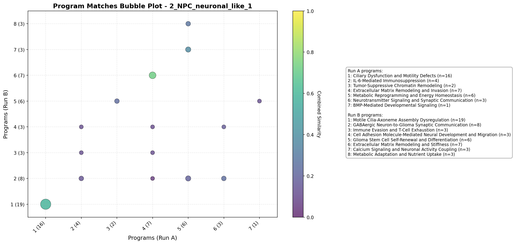
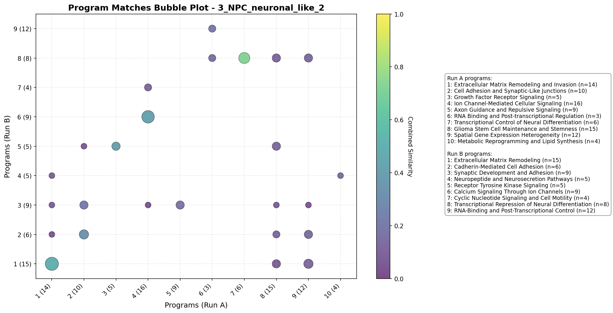
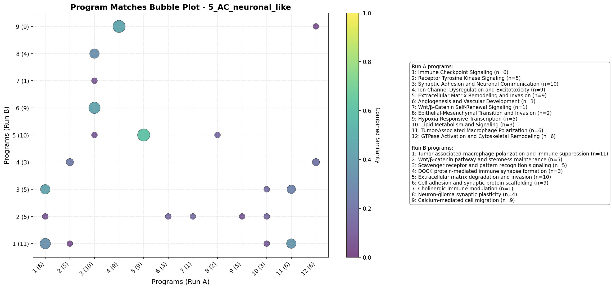

# Validation Report: glioblastoma_ds_auto

Master validation report comparing all DeepSearch runs across queries.

## Summary

- **Total Matches**: 43
- **Queries**: 8

- **Average Gene Jaccard**: 0.481
- **Average Name Similarity**: 0.307
- **Average Combined Similarity**: 0.429

## Per-Query Analysis

### Query: 0_Gliosis

**Matches**: 3

#### Comparison Table

| Run A | Run B | Program A | Program B | Gene Jaccard | Name Sim | Combined |
|-------|-------|-----------|-----------|--------------|----------|----------|
| 20251126_125238 | 20251126_135814 | EMT-Driven Invasive Dispersal | EMT-Driven Invasion Program | 0.375 | 0.200 | 0.322 |
| 20251126_125238 | 20251126_135814 | IL-6/IL-1β-NF-κB/STAT3 Signaling Axis | Pro-Inflammatory Cytokine Signaling | 0.444 | 0.200 | 0.371 |
| 20251126_125238 | 20251126_135814 | Apoptosis Evasion and Drug Resistance | Apoptosis Resistance and Survival Signaling | 0.333 | 0.429 | 0.362 |

#### Bubble Plot

#### Individual Run Reports

- [20251126_125238](../0_Gliosis/20251126_125238/deepsearch_container.md)
- [20251126_135814](../0_Gliosis/20251126_135814/deepsearch_container.md)

### Query: 10_AC_gliosis_like_2

**Matches**: 7

#### Comparison Table

| Run A | Run B | Program A | Program B | Gene Jaccard | Name Sim | Combined |
|-------|-------|-----------|-----------|--------------|----------|----------|
| 20251126_132637 | 20251126_144326 | Extracellular Matrix Remodeling and Invasion | Epithelial-Mesenchymal Transition | 0.500 | 0.000 | 0.350 |
| 20251126_132637 | 20251126_144326 | Extracellular Matrix Remodeling and Invasion | Extracellular Matrix Remodeling | 0.381 | 0.600 | 0.447 |
| 20251126_132637 | 20251126_144326 | RTK/MAPK Signaling Inhibition and Feedback | Receptor Tyrosine Kinase Signaling | 0.385 | 0.125 | 0.307 |
| 20251126_132637 | 20251126_144326 | Glioma Stem Cell Maintenance and Self-Renewal | Glioma Stem Cell Maintenance | 0.231 | 0.667 | 0.362 |
| 20251126_132637 | 20251126_144326 | Calcium Signaling and Ion Homeostasis | Calcium-Mediated Proliferation and Survival | 0.615 | 0.125 | 0.468 |
| 20251126_132637 | 20251126_144326 | Mesenchymal Differentiation and Epithelial-Mesenchymal Transition | Extracellular Matrix Remodeling | 0.467 | 0.000 | 0.327 |
| 20251126_132637 | 20251126_144326 | Immune Modulation and Inflammatory Signaling | Immune Microenvironment Modulation | 0.300 | 0.333 | 0.310 |

#### Bubble Plot

#### Individual Run Reports

- [20251126_132637](../10_AC_gliosis_like_2/20251126_132637/deepsearch_container.md)
- [20251126_144326](../10_AC_gliosis_like_2/20251126_144326/deepsearch_container.md)

### Query: 11_OPC_like_1

**Matches**: 7

#### Comparison Table

| Run A | Run B | Program A | Program B | Gene Jaccard | Name Sim | Combined |
|-------|-------|-----------|-----------|--------------|----------|----------|
| 20251126_133059 | 20251126_144843 | Oligodendrocyte differentiation and myelin formation | Oligodendrocyte Lineage Progenitor Identity | 0.545 | 0.125 | 0.419 |
| 20251126_133059 | 20251126_144843 | Notch signaling and neural stem cell maintenance | Notch Signaling and Stem Cell Maintenance | 0.600 | 0.857 | 0.677 |
| 20251126_133059 | 20251126_144843 | Ion homeostasis and osmotic cell volume regulation | Ion Channel-Mediated Cell Motility | 0.700 | 0.222 | 0.557 |
| 20251126_133059 | 20251126_144843 | Extracellular matrix remodeling and vasculature assembly | Extracellular Matrix Remodeling and Cell Adhesion | 0.412 | 0.500 | 0.438 |
| 20251126_133059 | 20251126_144843 | Lipid metabolism and myelin-derived nutrient scavenging | Lipid Metabolism and Sphingolipid Remodeling | 0.455 | 0.375 | 0.431 |
| 20251126_133059 | 20251126_144843 | Lipid metabolism and myelin-derived nutrient scavenging | Mitochondrial Dynamics and Cellular Metabolism | 0.375 | 0.222 | 0.329 |
| 20251126_133059 | 20251126_144843 | Growth factor receptor signaling networks | Growth Factor Receptor Signaling and Proliferation | 0.333 | 0.571 | 0.405 |

#### Bubble Plot

#### Individual Run Reports

- [20251126_133059](../11_OPC_like_1/20251126_133059/deepsearch_container.md)
- [20251126_144843](../11_OPC_like_1/20251126_144843/deepsearch_container.md)

### Query: 12_NPC_neuronal_like_3

**Matches**: 6

#### Comparison Table

| Run A | Run B | Program A | Program B | Gene Jaccard | Name Sim | Combined |
|-------|-------|-----------|-----------|--------------|----------|----------|
| 20251126_133359 | 20251126_145428 | Terminal Neuronal Differentiation Blockade | Neuronal differentiation transcription factor cascade | 0.412 | 0.286 | 0.374 |
| 20251126_133359 | 20251126_145428 | GABAergic Synaptic Tumor Promotion | Glutamate-calcium excitatory signaling | 0.467 | 0.000 | 0.327 |
| 20251126_133359 | 20251126_145428 | Axon Guidance & Cell Adhesion Dysregulation | Axon guidance and cell adhesion | 0.579 | 0.571 | 0.577 |
| 20251126_133359 | 20251126_145428 | Vascular Growth Factor Signaling & Angiogenesis | Neurofibromatosis and growth factor signaling | 0.750 | 0.375 | 0.637 |
| 20251126_133359 | 20251126_145428 | Axonal Maintenance & Cytoskeletal Integrity | Synaptic proteins and cytoskeletal dynamics | 0.625 | 0.111 | 0.471 |
| 20251126_133359 | 20251126_145428 | Apoptosis Resistance & Cell Survival Pathways | Apoptosis regulation and cell death | 0.500 | 0.222 | 0.417 |

#### Bubble Plot

#### Individual Run Reports

- [20251126_133359](../12_NPC_neuronal_like_3/20251126_133359/deepsearch_container.md)
- [20251126_145428](../12_NPC_neuronal_like_3/20251126_145428/deepsearch_container.md)

### Query: 1_OPC_AC_like_1

**Matches**: 5

#### Comparison Table

| Run A | Run B | Program A | Program B | Gene Jaccard | Name Sim | Combined |
|-------|-------|-----------|-----------|--------------|----------|----------|
| 20251126_125736 | 20251126_140224 | CD44-mediated Invasive Adhesion | Tumor Microenvironment Immune Regulation | 0.500 | 0.000 | 0.350 |
| 20251126_125736 | 20251126_140224 | Extracellular Matrix Remodeling | Extracellular Matrix Remodeling and Invasion | 0.182 | 0.600 | 0.307 |
| 20251126_125736 | 20251126_140224 | Immune Evasion and Checkpoint Regulation | Immune Evasion Through Glycosylation | 0.400 | 0.286 | 0.366 |
| 20251126_125736 | 20251126_140224 | Immune Evasion and Checkpoint Regulation | Tumor Microenvironment Immune Regulation | 0.400 | 0.286 | 0.366 |
| 20251126_125736 | 20251126_140224 | GFAP Isoform-dependent Malignancy | Transcriptional and Epigenetic Plasticity Control | 0.500 | 0.000 | 0.350 |

#### Bubble Plot

#### Individual Run Reports

- [20251126_125736](../1_OPC_AC_like_1/20251126_125736/deepsearch_container.md)
- [20251126_140224](../1_OPC_AC_like_1/20251126_140224/deepsearch_container.md)

### Query: 2_NPC_neuronal_like_1

**Matches**: 3

#### Comparison Table

| Run A | Run B | Program A | Program B | Gene Jaccard | Name Sim | Combined |
|-------|-------|-----------|-----------|--------------|----------|----------|
| 20251126_130034 | 20251126_140831 | Ciliary Dysfunction and Motility Defects | Motile Cilia-Axoneme Assembly Dysregulation | 0.842 | 0.000 | 0.589 |
| 20251126_130034 | 20251126_140831 | Extracellular Matrix Remodeling and Invasion | Extracellular Matrix Remodeling and Stiffness | 0.750 | 0.667 | 0.725 |
| 20251126_130034 | 20251126_140831 | Metabolic Reprogramming and Energy Homeostasis | Calcium Signaling and Neuronal Activity Coupling | 0.500 | 0.100 | 0.380 |

#### Bubble Plot

#### Individual Run Reports

- [20251126_130034](../2_NPC_neuronal_like_1/20251126_130034/deepsearch_container.md)
- [20251126_140831](../2_NPC_neuronal_like_1/20251126_140831/deepsearch_container.md)

### Query: 3_NPC_neuronal_like_2

**Matches**: 5

#### Comparison Table

| Run A | Run B | Program A | Program B | Gene Jaccard | Name Sim | Combined |
|-------|-------|-----------|-----------|--------------|----------|----------|
| 20251126_130035 | 20251126_141307 | Extracellular Matrix Remodeling and Invasion | Extracellular Matrix Remodeling | 0.450 | 0.600 | 0.495 |
| 20251126_130035 | 20251126_141307 | Cell Adhesion and Synaptic-Like Junctions | Cadherin-Mediated Cell Adhesion | 0.333 | 0.333 | 0.333 |
| 20251126_130035 | 20251126_141307 | Growth Factor Receptor Signaling | Receptor Tyrosine Kinase Signaling | 0.429 | 0.333 | 0.400 |
| 20251126_130035 | 20251126_141307 | Ion Channel-Mediated Cellular Signaling | Calcium Signaling Through Ion Channels | 0.471 | 0.286 | 0.415 |
| 20251126_130035 | 20251126_141307 | Transcriptional Control of Neural Differentiation | Transcriptional Repression of Neural Differentiation | 0.750 | 0.667 | 0.725 |

#### Bubble Plot

#### Individual Run Reports

- [20251126_130035](../3_NPC_neuronal_like_2/20251126_130035/deepsearch_container.md)
- [20251126_141307](../3_NPC_neuronal_like_2/20251126_141307/deepsearch_container.md)

### Query: 5_AC_neuronal_like

**Matches**: 7

#### Comparison Table

| Run A | Run B | Program A | Program B | Gene Jaccard | Name Sim | Combined |
|-------|-------|-----------|-----------|--------------|----------|----------|
| 20251126_130844 | 20251126_142015 | Immune Checkpoint Signaling | Tumor-associated macrophage polarization and immune suppression | 0.417 | 0.125 | 0.329 |
| 20251126_130844 | 20251126_142015 | Immune Checkpoint Signaling | Scavenger receptor and pattern recognition signaling | 0.571 | 0.125 | 0.437 |
| 20251126_130844 | 20251126_142015 | Synaptic Adhesion and Neuronal Communication | Cell adhesion and synaptic protein scaffolding | 0.462 | 0.375 | 0.436 |
| 20251126_130844 | 20251126_142015 | Synaptic Adhesion and Neuronal Communication | Neuron-glioma synaptic plasticity | 0.400 | 0.143 | 0.323 |
| 20251126_130844 | 20251126_142015 | Ion Channel Dysregulation and Excitotoxicity | Calcium-mediated cell migration | 0.636 | 0.000 | 0.445 |
| 20251126_130844 | 20251126_142015 | Extracellular Matrix Remodeling and Invasion | Extracellular matrix degradation and invasion | 0.583 | 0.667 | 0.608 |
| 20251126_130844 | 20251126_142015 | Tumor-Associated Macrophage Polarization | Tumor-associated macrophage polarization and immune suppression | 0.308 | 0.500 | 0.365 |

#### Bubble Plot

#### Individual Run Reports

- [20251126_130844](../5_AC_neuronal_like/20251126_130844/deepsearch_container.md)
- [20251126_142015](../5_AC_neuronal_like/20251126_142015/deepsearch_container.md)
